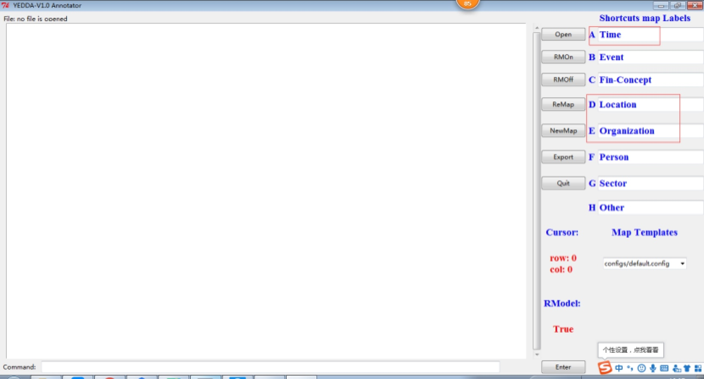
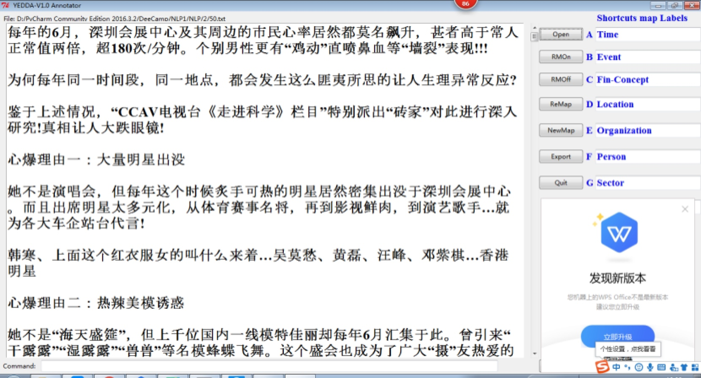
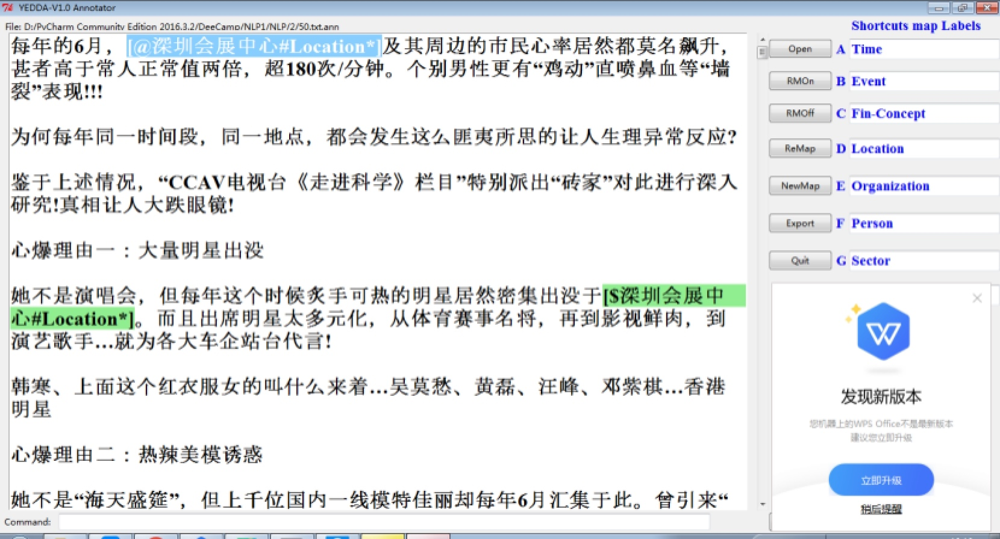
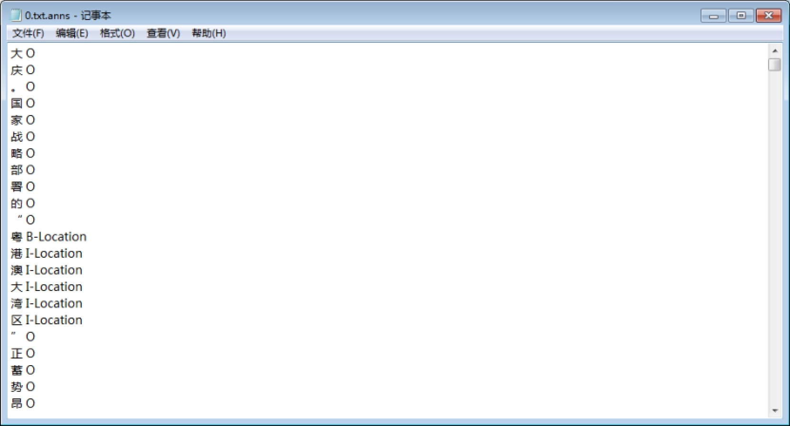

# 命名实体
### 目标 对车展文本中时间、地点、举办方
可爬取新闻获得数据集，本项目的[数据集](./NLP/data/CarReport.rar) 
### 数据标注
1. anaconda 新建新的虚拟环境: conda create -n envname
2. 在环境中安装 python2.7 : conda install python=2.7.
3. git clone https://github.com/jiesutd/YEDDA.git
4. cd YEDDA & python YEDDA.py
    * 使用界面 三类标注分别对应红框中ADE
     
    * 文件标注 点击open打开txt文件
    
    * 选择位置 使用ADE快捷键标注 和 Q快捷键 删除
    
    * export可生成文件
    
    * TIME = 时间 LOCATION = 地址 ORGANIZATION = 展会名字

### 数据训练
```
python BERT_NER.py --data_dir=data/ --bert_config_file=checkpoint/bert_config.json --init_checkpoint=checkpoint/bert_model.ckpt --vocab_file=vocab.txt --output_dir=./output/result_dir/
```

### 数据测试

```
python BERT_NER.py --data_dir=data/ --bert_config_file=checkpoint/bert_config.json --init_checkpoint=这里改成自己的checkpoint --vocab_file=vocab.txt --output_dir=./output/result_dir/ --do_train=False --do_predict=True
```
